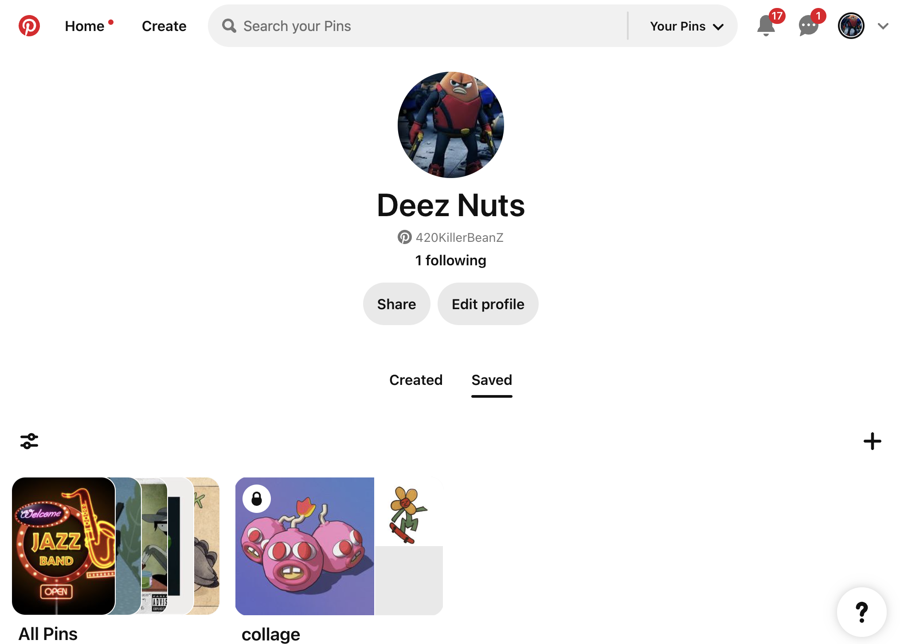

# Procesverslag
Markdown is een simpele manier om HTML te schrijven.  
Markdown cheat cheet: [Hulp bij het schrijven van Markdown](https://github.com/adam-p/markdown-here/wiki/Markdown-Cheatsheet).

Nb. De standaardstructuur en de spartaanse opmaak van de README.md zijn helemaal prima. Het gaat om de inhoud van je procesverslag. Besteedt de tijd voor pracht en praal aan je website.

Nb. Door *open* toe te voegen aan een *details* element kun je deze standaard open zetten. Fijn om dat steeds voor de relevante stuk(ken) te doen.

## Jij

  
uitwerken voor kick-off werkgroep

  ### Auteur:
  Colin Twisker

  #### Je startniveau:
Rood 

  #### Je focus:
  Responsiveness
 

## Je website

  
uitwerken voor kick-off werkgroep

  ### Je opdracht:
  Voor deze opdracht heb ik Pinterest gekozen. Als student designer gebruik ik pinterest best vaak en daarom ben ik benieuwd wat ik aan de website kan gaan verbeteren.

  Pinterest
  https://nl.pinterest.com/

  De pagina's die ik na wil gaan maken zijn de home pagina en de profiel pagina die beide een zoekbalk uit laten klappen. De home pagina heeft bijzondere elementen zoals hover links en gifs die ik wil gaan proberen na te maken. De profiel pagina heeft een nette lay-out die ik ook wil proberen na te maken.

  #### Screenshot(s) van de eerste pagina (small screen): 
  Home pagina 
  

  #### Screenshot(s) van de tweede pagina (small screen):
  Profiel pagina
  
 
  #### Screenshot(s) Dynamisch deel(small screen):
  Zoekbalk
  

## Toegankelijkheidstest 1/2 (week 1)

  
uitwerken na test in 2e werkgroep

  ### Bevindingen
  Lijst met je bevindingen die in de test naar voren kwamen:

  ### Blaadje WCAG checklist
  
  
  
  
  

Mijn bevindingen:

Pinterest gebruikt overmatig veel divs en is niet semantisch netjes. Verder maakt Pinterest ook geen gebruik van headings. Ook worden er geen lists gebruikt terwijl pinterst vaak informatie heeft dat eigenlijk in een list zou horen. Niet elke afbeelding heeft een goede alt tekst waardoor gebruikers met een visuele beperking niet goed kunnen weten wat er op de afbeelding staat. Als laatste is de contrast van de navigatie iconen niet heel goed te zien, deze zijn licht grijs op een witte achtergrond.

Samengevat heeft pinterest de volgende problemen:
- Te veel divs
- Geen headings
- Geen lists
- Ontbrekende duidelijke alt
- Slecht icoon contrast

## Breakdownschets (week 1)

  
uitwerken na afloop 3e werkgroep

  ### de hele pagina: 
  Dit is mijn breakdown schets van de home page:
  

  ### wellicht nog een dynamisch deel (bijv filter): 
  Dit is mijn breakdown schets van de profiel page op de website:
  

## Voortgang 1 (week 2)

  
uitwerken voor 1e voortgang

  ### Stand van zaken
  hier dit ging goed & dit was lastig (neem ook screenshots op van delen van je website en code)

  Het begin van het maken van de opzet van de navigatie gaat tot nu to goed. Ik heb eerder flexbox gebruikt waardoor ik iniedergeval weet hoe ik van werk moet gaan. Ik zou nog wel de opmaak hiervan een stuk netter mogen maken.
  

  Ik vind het alleen lastig hoe ik de main content ga coderen. Ik weet nog niet hoe ik dit wil gaan doen. Nu zit ik te twijfelen tussen grid en flexbox, maar ik ga als eerste grid uitproberen.

  ### Agenda voor meeting
  samen met je groepje opstellen

  | student 1      | student 2          | student 3    | student 4        |
  | ---            | ---                | ---          | ---              |
  | dit bespreken  | en dit             | en ik dit    | en dan ik dat    |
  | en dat ook nog | dit als er tijd is | nog een punt | dit wil ik zeker |
  | ...            | ...                | ...          | ...              |

  ### Verslag van meeting
  hier na afloop snel de uitkomsten van de meeting vastleggen

  Uitkomsten: 

  De navigatie zou een stuk beter zijn als het uit meerdere nav elementen bestaat en deze moeten dan nog in een header gezet worden. Verder heb ik nog weinig aan de toengankelijkheid gedaan dus moet ik hier nog snel aandacht aan gaan geven. Zo kan ik de toegangelijkheid beter intergreren in mijn app ontwerp. De content waar de gebruiker doorheen kan scrollen is momenteel gemaakt met grid, maar op aanbeveling van de docent kan ik ook column count gaan gebruiken. Deze zouden de afbeeldingen en tekst op een natuurlijkere manier op de website positioneren.

  Belangrijkste samengevat:

  - Navigatie mag bestaan uit meerdere navs en die dan het liefst in de header plaatsen.
  - Zorg dat je nu al bezig bent met toegankelijkheid
  - De scroll content kan je beter met flex of column count maken inplaats van grid.

## Voortgang 2 (week 3)

  
uitwerken voor 2e voortgang

  ### Stand van zaken
  hier dit ging goed & dit was lastig (neem ook screenshots op van delen van je website en code)

  Ik heb nog een tijdje de afbeeldingen (scoll content) proberen netjes te positioneren met grid, maar dit kreeg ik niet voor elkaar. Uiteindelijk op de advies van de docent uit het vorige feedback gesprek ben ik toch met column count gaan werken. Hier moest ik eerst nog wel even de tijd voor nemen om online te leren hoe column count werkt, dit was namelijk niet deel van de uitleg in de lessen.

  
  

  ### Agenda voor meeting
  samen met je groepje opstellen

  | student 1      | student 2          | student 3    | student 4        |
  | ---            | ---                | ---          | ---              |
  | dit bespreken  | en dit             | en ik dit    | en dan ik dat    |
  | en dat ook nog | dit als er tijd is | nog een punt | dit wil ik zeker |
  | ...            | ...                | ...          | ...              |

  ### Verslag van meeting
  hier na afloop snel de uitkomsten van de meeting vastleggen

  Uitkomsten:

  Er mogen geen classes of id's gebruikt worden tenzij het echt noodzakelijk is. Alleen ik had al veel met classes en id's gewerkt dus dit moet ik allemaal weer gaan veranderen en hiervoor iets lastigere selectors gaan gebruiken. Verder kan ik de darkmode nog gaan verbeteren door de iconen zoals de plusjes en kruisjes laten veranderen door een witte variant. Zo zouden deze ook beter te zien zijn.

  Belangrijkste samengevat:

  - Ik mag geen classes of ID's gebruiken
  - Darkmode kan ik verbeteren door de afbeeldingen naar een witte versie te laten veranderen met prefers color scheme
  - Ik mag de body van de 2e html pagina een class naam geven zodat het niet te moeilijk wordt met selectors.

## Toegankelijkheidstest 2/2 (week 4)

  
uitwerken na test in 9e werkgroep

  ### Bevindingen
  In de 2e toegankelijkheidstest heb ik de volgenden bevindingen gevonden:

  Lijst met je bevindingen die in de test naar voren kwamen (geef ook aan wat er verbeterd is):

  ### Negatieve bevindingen
  Uit de 2e toengankelijkheidstest bleek dat ik geen visible focus style heb voor de interactieve en navigeerbare elementen. Daarnaast zijn de knoppen in de navigatie een beetje klein en daarom ook moeilijk te activeren. Verder mis ik nog een skiplink voor de visueel beperkte gebruikers. Voor een paar van de afbeeldingen kloppen de alt attributen niet helemaal, sommige staan in het nederlands geschreven en de andere in het engels. Dit zorgt ervoor dat de voice over sommige alt attributen verkeerd uitspreekt. 

  Voor de scroll content is er media (Gifs) die automatisch afspelen maar sinds je gifs niet kan pauzeren zou ik niet weten hoe ik dit moet oplossen. Verder volgen de animaties de prefers-reduced motion media query nog niet.

  Een andere bevinding is dat de uitschuif zoekbalk niet uitklapbaar/selecteerbaar is via de toetsenbord knoppen.

  ### Verbeterde bevindingen
  De pagina's zijn nu gevalideerd en hebben elk een unieke titel en elk één h1. De interactieve elementen naast de zoekbalk zijn nu wel navigeerbaar met het toetsenbord. Daarnaast hebben ze nu ook meer ruimte tussen elkaar voor een betere scroll gebied. Verder wordt list content nu wel in list elementen geplaatst. Voor de knoppen heb ik nu button elementen gebruikt inplaats van divs met de opmaak van een button. Darkmode en light mode worden onderstuind en de kleur contrast van de knoppen en tekst zijn verbeterd.

  ### Belangrijkste samengevat
  - Maak een goede zichtbare focus style.
  - Vergroot de navigatie knop iconen.
  - Maak een skiplink.
  - Verander de alt attributen allemaal in het engels.
  - Zorg dat de animaties de prefers-reduced motion media query volgen.

## Voortgang 3 (week 4)

  
uitwerken voor 3e voortgang

  ### Stand van zaken
  hier dit ging goed & dit was lastig (neem ook screenshots op van delen van je website en code)

  ### Ging goed:
  De eerste animatie die ik had gemaakt ging goed en daarom heb ik een tweede animatie gemaakt. In deze tweede animatie heb ik de custom bezier website gebruikt om de animatie een soort bounce effect te geven.
  
  

  #### Ging slecht:
  Ik kwam er maar niet achter waarom ik niet met de keyboard door de website content kon tabben, maar uiteindelijk kwam ik er achter dat ik niet alle afbeeldingen een link had toegegeven en daarom ook niet interactief waren.
  

  Ook had ik moeite met een hele specifieke section te selecteren zonder een andere section ook toe te voegen. Uiteindelijk heb ik een has selector gebruikt die gelukkig wel werkt.
  
  

  ### Vragen die ik heb voor voortgangsgesprek

  -Ik heb elk label en text op mijn website in het engels staan net zoals de echte website. Alleen heb ik de alt attributen in het nederlands staan. Moet ik dan een lang="nl" of lang="en"

  -Voor de focus states moet ik elk element opnieuw stijlen met een specifieke bijpassende border of stijl?

  -Mijn uitschuifbalk is niet selecteer baar in voice over modus. Hoe fix ik dit?

  -De uitschuifbalk krijg ik niet mooi gepositioneerd bij grote schermen. Moet ik hiervoor dan mediaquerys gebruiken?

 

  ### Agenda voor meeting
  samen met je groepje opstellen

  | student 1      | student 2          | student 3    | student 4        |
  | ---            | ---                | ---          | ---              |
  | dit bespreken  | en dit             | en ik dit    | en dan ik dat    |
  | en dat ook nog | dit als er tijd is | nog een punt | dit wil ik zeker |
  | ...            | ...                | ...          | ...              |

  ### Verslag van meeting
  hier na afloop snel de uitkomsten van de meeting vastleggen

  De volgorde van mijn headings kloppen nog niet. Zo gebruik ik bijvoorbeeld h7 en h8 terwijl de headings elementen maar tot h6 mogen lopen. Verder staat mijn code een beetje door elkaar waardoor het lastig is om code terug te vinden. Daarom moet ik de code die bij elkaar hoort onder elkaar zetten met een comment die laat zien waar de code begint/stopt en wat de code doet. Ook moet ik nog een bronnenlijst gaan toevoegen. De uisschuifbalk/zoekbalk staat nu in een nav element maar het zou semantisch netter zijn als het in een section element staat.

  ### Belangrijkste samengevat: 
  - Bronnenlijst moet nog.
  - Code beter bij elkaar geordend.
  - Heading moet ik laten kloppen
  - Uitschuifbalk staat in nav mr gelieve in een section hebben

## Eindgesprek (week 5)

  
uitwerken voor eindgesprek

  ### Je uitkomst - karakteristiek screenshots:
  

  ### Dit ging goed/Heb ik geleerd: 
  Korte omschrijving met plaatjes

  Ik heb geleerd hoe ik websites responsive maak doormiddel van gebruik te maken van verschillende media-querys. 
  

  Ik heb geleerd hoe ik een darkmode kan maken door kleuren in de root te zetten en de media prefers color scheme dark te gebruiken. Daarnaast heb ik geleerd hoe ik de url van een afbeelding kan veranderen zodat het in een andere variant voor de darkmode veranderd.
  

  ### Dit was lastig/Is niet gelukt:
  Korte omschrijving met plaatjes

  #### Niet gelukt
  Ik kwam in tijdsnood dus lukte het mij niet om op te zoeken hoe ik prefer animatie kan maken en hoe ik het in mijn website kon toepassen.
  

  #### Lastig
  Ik had veel moeite met de uitschuifbalk/zoekbalk te laten werken op telefoon formaat. Zo was het moeilijk om de zoekopdrachten te laten passen op het kleine formaat maar nog wel leesbaar te maken.
  

## Feedback/reflectie uit het eindgesprek (week 5)

  
  ### Feedback
  Sommige elementen zoals de plaatjes in de scroll content hebben als animatie nu een transitie, maar het zou leuk zijn als ze geanimeerd worden zoals de h1 met keyframes.
 
  De focus stijl moet eigenlijk in een andere kleur, want ik heb wel de kleur van de focus style veranderd maar dat is eigenlijk niet te zien sinds het zo op de orginele kleur lijkt.

  Als je op bepaalde afbeeldingen hovert worden ze iets groter gemaakt. Het zou ook leuk zijn als hetzelfde gebeurd op de andere afbeeldingen.

  Verder is de uitschuif zoekbalk niet heel netjes gemaakt. Zo staan de kruisjes in de zoekbalk niet helemaal even met de tekst.
  

  ### Het belangrijkste voor een voldoende
  De website zelf voldoet aan een voldoende maar de README proces verslag is te minimaal. Zo ontbreekt de tweede toegankelijkheids test in het verslag en bestaat het verslag uit alleen maar bulletpoints.
 

## Dit heb ik verbeterd (herkansing)

### Veranderd:

#### Kruisen:
De kruisen heb ik wat groter gemaakt zodat de gebruikers met slecht zicht deze beter kunnen zien ook op klein scherm formaat. De kruisen staan nu recht met de tekst en staat in 1 volledige zin inplaats van dat de tekst lelijk gebroken staat in 2 lijnen tekst.

#### Focus style:
De focusstijl heb ik van de blauw die leek op de oorspronkelijke focus style naar de kleur groen veranderd. De groen valt goed op tegen de kleur van rood dat veel op de pinterest website wordt gebruikt en ook heb ik de lijn iets dikker gemaakt zodat het beter opvalt.

#### Zoekbalk:
Ik heb voor in de darkmode de achtergrond kleur van de zoekbalk donkerder gemaakt zodat je het icoontje en de tekst er in goed kan zien.

#### Proces verslag:
Daarnaast heb ik mijn proces verslag verbeterd, zo heb ik nu het proces uitgeschreven inplaats van alleen maar bulletpoints te gebruiken. Daarnaast heb ik de tweede toegankelijkheids test die eerst ontbrak nu aangevuld.

### Reflectie
Ik heb in dit vak geleerd dat het belangrijk is om vroeg te beginnen met de toegankelijkheid. Door vroeg te beginnen kan je toegankelijkheid mooi intergreren in je website en hoef je niet hele grote stukken van je website later in eens te veranderen. Ook heb ik geleerd dat het schrijven van het proces verslag net zo belangrijk is als het coderen zelf. Met het proces verslag kan je bijvoorbeeld netjes bijhouden wat je hebt gedaan en nog moet doen. Verder heb ik geleerd dat kleine details, zoals de uitlijning van een kruis naast een kopje en een hover animatie van een afbeelding een uiteindelijke grote impact kunnen hebben op de gehele feel en opmaak van de website.

Daarnaast heb ik ook veel technische dingen geleerd. Zo weet ik hoe ik een nette lay-out kan maken door gebruik te maken van grid of column count. Ook weet ik nu hoe ik met gemak een darkmode voor een app of website kan maken en hoe ik deze responsive maak.

## Bronnenlijst

  
continu bijhouden terwijl je werkt

  Nb. Wees specifiek ('css-tricks' als bron is bijv. niet specifiek genoeg). 
  Nb. ChatGpT en andere AI horen er ook bij.
  Nb. Vermeld de bronnen ook in je code.

  1. Has selectors:
  https://developer.mozilla.org/en-US/docs/Web/CSS/:has
  2. Hover focus states:
  https://zellwk.com/blog/style-hover-focus-active-states/
  3. Darkmode redesign:
  https://stuffandnonsense.co.uk/blog/redesigning-your-product-and-website-for-dark-mode
  4. Multi column:
  https://www.w3schools.com/css/css3_multiple_columns.asp
  5. Break inside avoid: 
  https://developer.mozilla.org/en-US/docs/Web/CSS/CSS_multicol_layout/Handling_content_breaks_in_multicol_layout
  6. Afbeeldingen en gifs:
 https://nl.pinterest.com/
 7. Bezier animatie:
 https://tools.webdevpuneet.com/css-easing-generator/

